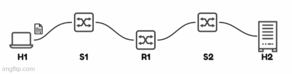

# Pasos para Ejecutar el Script

## Esquema grafico de la topologia de la red


## Inicio de la topologia de la red

Ejecutar el script principal `topo.py`:
```bash
sudo python3 topo.py
```
- Aclaracion: recuerde entrar al directorio `~/anexo` antes de correr este comando.

## TCP

1. Iniciar el servidor `iperf` en `h2`:
    ```bash
    mininet> h2 iperf -s &
    ```

2. Ejecutar Wireshark en `h2`:
    ```bash
    mininet> h2 wireshark &
    ```

3. Ejecutar Wireshark en el router. La clave esta en abrirlo 2 veces pero uno en el link de entrada (`r1-eth0`) y otro en el de salida (`r1-eth1`):
    ```bash
    mininet> r1 wireshark &
    mininet> r1 wireshark &
    ```

4. Iniciar el cliente `iperf` desde `h1`:
    ```bash
    mininet> h1 iperf -c h2 -l 1400 -t 1
    ```

## UDP

1. Iniciar el servidor `iperf` en `h2`:
    ```bash
    mininet> h2 iperf -s -u &
    ```

2. Ejecutar Wireshark en `h2`:
    ```bash
    mininet> h2 wireshark &
    ```

3. Ejecutar Wireshark en el router. La clave esta en abrirlo 2 veces pero uno en el link de entrada (`r1-eth0`) y otro en el de salida (`r1-eth1`):
    ```bash
    mininet> r1 wireshark &
    mininet> r1 wireshark &
    ```

4. Iniciar el cliente `iperf` desde `h1` con soporte para UDP:
    ```bash
    mininet> h1 iperf -c h2 -l 1400 -t 1 -u
    ```
